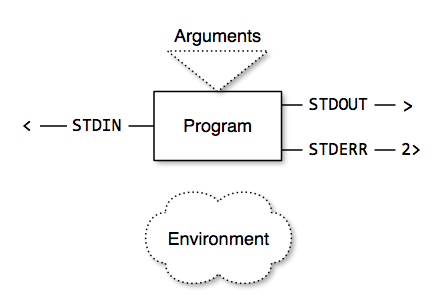

title: Unix Command Line Filters
date: 2014-11-10
author:
    name: Peter Eichman
    email: peichman@umd.edu
output: presentation.html

--

# Think in Filters

## Introduction to the Unix Command Line

--

### Command Line Programs

- Arguments
- "Connectors"
- Environment Variables

<!--

This includes the programs that come with the OS, software you install, as well
as scripts that you write. A lot of Unix software is actually scripts.

/-->

--

### Command Line Programs

--

### Arguments

- Additional settings given after the program name
- In Bash, these become the variables `$1`, `$2`, etc.
- Like knobs, dials, and switches for your program

--

### Connectors

- Every program has 3 default connectors
    - STDIN (0)
    - STDOUT (1)
    - STDERR (2)

<!--

Technically, these are "file descriptors", since on Unix, everything is a file.
Even your console.

/-->

--

### Default Connectors

- Normally connected to your console:
    - STDIN from keyboard
    - STDOUT and STDERR to screen

--

### Input/Output Redirection with Files

- You can also connect them to files:
    - STDIN: `command < input.txt`
    - STDOUT: `command > output.txt`
    - STDOUT (append): `command >> log.txt`
    - STDERR: `command 2> errors.txt`
    - STDERR (append): `command 2>> error_log.txt`

--

### Input/Output Redirection with Files

- All at the same time:
- `command < input.txt > output.txt 2> errors.txt`

<!--

However, it is a common Unix idiom to specify the input filename (or filenames)
as arguments on the command line. But a well-behaved Unix program will also
accept its input on STDIN.

/-->

--

### Connecting Programs

- Pipes
- Connect one program's STDOUT to the next program's STDIN
- `ls | wc -l`

--

### Environment Variables

- Set: `VARIABLE=value`
- Get: `$VARIABLE`
- Can control the behavior of commands and programs
- Scripts can use them to find out about the environment they are running in
  (e.g., `$HOME`, `$PWD`)
- Use them to store intermediate values in your scripts

--

### The Unix Way

- Do one thing and do it well
- Break a complex task up into simpler pieces

--

### (Almost) Everything is a Filter

- Build programs as filters
    1. Read STDIN
    2. Process
    3. Write to STDOUT

<!--

The exception to (1) is when your program is getting its input from an external
source, like the filesystem in the case of ls or find.

There are also some exceptions to (3), such as sendmail or lp, where the data is
handed off to the network or another device rather than being written to STDOUT.

/-->

--

### Development Strategies

- Build pipes on the command line
- Transfer them to a script once you have them working
- Look for existing tools
- Think of pipes when you hear "and"

<!--

If you find yourself describing a problem by saying "do A, and then do B", it is
probably best to look for (or write) two separate programs, one that daoes A and
one that does B. Especially if one or the other of those is a generic task, like
sorting, counting, etc.

Even if your original problem statement doesn't contain "and then" statements,
it may help you approach the problem if you rephrase it that way. Compare "count
all index.html files" to "find all the index.html files, and then count that
list". The second form suggests a simple pipe command, "find . -name index.html
| wc -l".

/-->

--

### More Complex Problems

- Use a scripting language to write the necessary piece
- Awk, Perl, Python, Ruby

--

### Parsing Data Formats

- Parsing of more complicated data formats
    - Sometimes quick-and-dirty is enough
    - Sometimes you want a robust solution
- Write your program using a library for your scripting language of choice
- Consider making the program as simple as possible
- Use existing tools to handle common tasks

--

### Input

- List the contents of a directory: `ls`
- Finding files or directories: `find`

--

### Processing

- Sorting: `sort`
- Find unique occurances: `sort | uniq`
- Filtering: `grep`
- Splitting input into columns: `cut`
- Search-and-replace: `sed`
- Counting: `wc`
- Pretty-print XML: `xmllint --format`
- Beginning or end of input: `head`, `tail`
- Convert a list to arguments: `xargs`

<!--

Think of xargs as "rotating" your input; it takes the list of things it gets on
its STDIN and "rotates" those into the argument positions of another command

/-->

--

### Processing CSV

- csvkit: <https://csvkit.readthedocs.org/en/0.9.0/>
    - Split by column: `csvcut`
    - Search/filter: `csvgrep`
    - Sort: `csvsort`
    - Combine: `csvjoin`
    - Pretty output: `csvlook`
    - ...and more
- It is also a Python library

--

### Output

- Paging: `less`
- Source code highlighting: `pygmentize`

<!--

These (mostly) only make sense when writing to the screen. Although pygments
does have an HTML output mode which would make sense to write to a file. This
just goes to show that good programs in Unix are filters, even unexpected ones.

You may need to install pygmentize by running `pip pygments`, or installing the
python-pygments package for your OS.

/-->

--

### Finding More Tools

- Search: `apropos "search term"`
- Help: `man command`
- Google

--

### Further Reading

- [Data Hand Tools](http://radar.oreilly.com/2011/04/data-hand-tools.html)
- [Internals of Familiar Unix Commands](http://perl.plover.com/yak/commands/)
- [Basics of the Unix Philosophy](http://www.catb.org/esr/writings/taoup/html/ch01s06.html)
